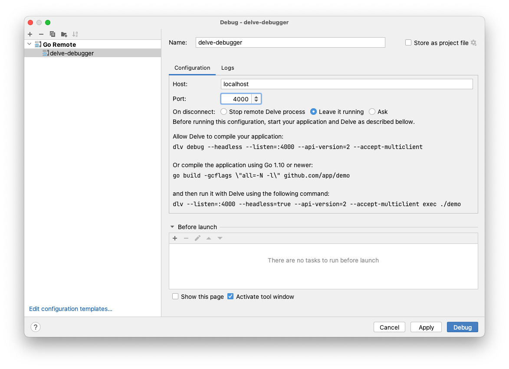

# Delve in Kubernetes and Docker

Debug your golang app running inside k8s or Docker

_(attaching an ephemeral container with [Delve](https://github.com/go-delve/delve) inside)_

## Usage: ad-hoc guides

Ad-hoc guides are provided for some projects:
- [Rancher](docs/guides/README-rancher.md)
- [Rancher fleet](docs/guides/README-fleet.md) and its components
- [k3d](docs/guides/README-k3d.md) ([k3s](https://k3s.io/) in Docker)

For other use cases follow instructions below.

## Usage: general

### Requirements
- the binary to debug **should** be compiled using `go build` with the following options (that disable optimizations):
```
-gcflags='all=-N -l'
```

- the binary to debug **must not** be compiled with the following options (that strip symbols):
 ```
 -ldflags '-s -w'
 ```

For Kubernetes:
- have `kubectl` available
- use k8s >= v1.18


### Running

For Kubernetes:
```
./delve-debugger.sh <NAMESPACE> <POD> <CONTAINER> <EXECUTABLE>
```

For Docker:
```
./delve-debugger-docker.sh <CONTAINER> <EXECUTABLE>
```

This will open local port 4000, which you can attach to from GoLand. If you need a port other than 4000, add the number as the last parameter.



Enjoy breakpoints, watches and stack inspection!

### Troubleshooting

**Q**: I get the error:
```
Could not attach to pid 1: this could be caused by a kernel security setting, try writing "0" to /proc/sys/kernel/yama/ptrace_scope
```

**A**: `/proc/sys/kernel/yama/ptrace_scope` is a host (node) kernel setting, its default value depends on your distro and configuration. You can change it as suggested via `echo 0 >/proc/sys/kernel/yama/ptrace_scope` as `root` on the node running the delve pod. If you do not have `root` shell access to the node but can run privileged containers, please [refer to these instructions](https://gist.github.com/moio/97c55fd742f407e294d370e4f4876f96).